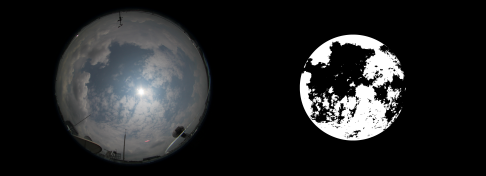

## Cloud coverage computation for a sample sky/cloud image

This repository is a minimalist working version of cloud coverage computation. This is inspired from the research performed in the following publications:

> S. Dev, Y. H. Lee, S. Winkler, Color-based segmentation of sky/cloud images from ground-based cameras, *IEEE Journal of Selected Topics in Applied Earth Observations and Remote Sensing*, vol. 10, no. 1, pp. 231-242, Jan 2017.

> S. Dev, Y. H. Lee, S. Winkler, Systematic Study of Color Spaces and Components for the segmentation of sky/cloud images, *Proc. IEEE International Conference on Image Processing (ICIP)*, Oct. 2014.

### Usage

+ Please store the sample input image inside the `image` folder. Please note that our images are captured by [WAHRSIS](https://arxiv.org/pdf/1605.06595.pdf), and have a fixed dimension of `5184x3456` pixels.
+ Run the script `python2 find_coverage.py`. This computes the following:
	+ Generates the resultant binary image, and saves it inside the `image` folder.
	+ Outputs and displays the cloud coverage ratio. Please note that we neglect the black border around the central circular region, while computing the cloud coverage value.